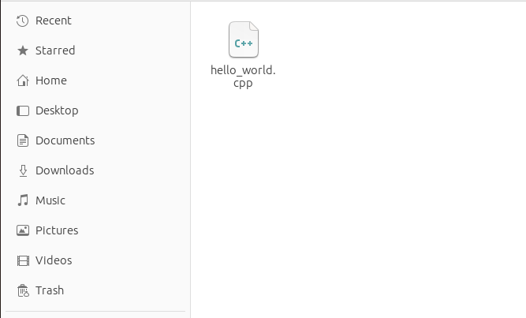
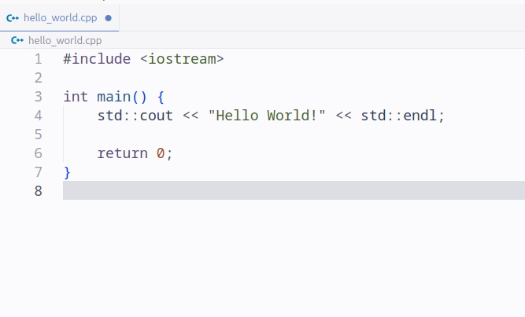

# Source Code, Kode Program, Compiler, dan Binary File
Pada cacatan sebelumnya, terdapat beberapa istilah seperti source code, kode program, compile, compiler. dan binary file . Istilah-istilah ini penting untuk dipahami karena sifatnya yang penting dalam memprograman dengan bahasa C++ dan akan hampir selalu digunakan di catatan-catatan belajar C++ selanjutnya.

## 2.1 Source Code
Source code atau kode sumber adalah file teks yang berisi instruksi-instuksi yang akan dikerjakan oleh komputer atau disebut juga kode program dalam tata bahasa C++. Tetapi tidak seperti file teks biasa yang umumnya berekstensi `.txt`, source code yang dibuat dengan bahasa pemrograman C++ memiliki ekstensi `.cpp`. 

*Gambar diatas adalah contoh dari file source code C++.*

## 2.2 Kode Program
Isi dari file source code disebut kode program, yang terdiri dari kumpulan instruksi-instruksi yang akan dikerjakan oleh komputer yang disebut juga syntax. 

*Gambar diatas adalah contoh dari kode program C++.*

## 2.3 Compiler
Source code yang ditulis dengan bahasa C++ belum dapat dijalankan oleh komputer. Ini dikarenakan, komputer hanya mengenali bahasa mesin berupa bilangan biner yang terdiri dari angka 0 dan 1. Untuk dapat menjalankan source code yang kita tulis dengan C++, kita membutuhkan sebuah aplikasi compiler yang bertugas untuk mengkonversi atau menterjemahkan source code yang masih berupa bahasa C++ yang dipahami manusia menjadi bahasa mesin yang dipahami oleh komputer. Proses mengkonversi atau menterjemahkan ini dinamakan dengan proses compile atau kompilasi.

## 2.4 Binary File
Dari proses kompilasi yang dilakukan compiler, akan menghasilkan file binary atau file aplikasi yang dapat dijalankan oleh komputer. File binary inilah yang dapat langsung dijalankan oleh komputer dan format ekstensi-nya mengikuti sistem operasi yang kita gunakan saat proses kompilasi. Seperti contoh, saat kita melakukan proses kompilasi di sistem operasi Microsoft Windows, maka ekstensi file binary-nya adalah “.exe”.

*Gambar diatas adalah contoh dari binary file atau file aplikasi hasil dari proses kompilasi source code C++.*