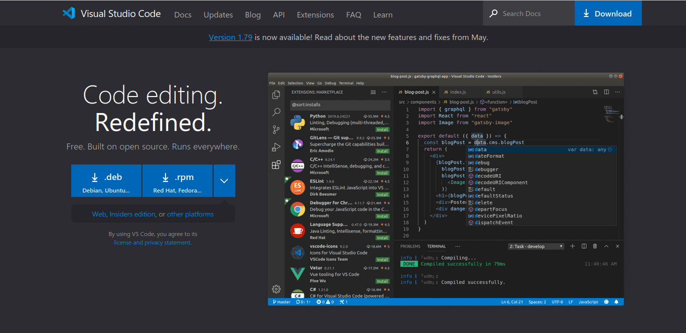
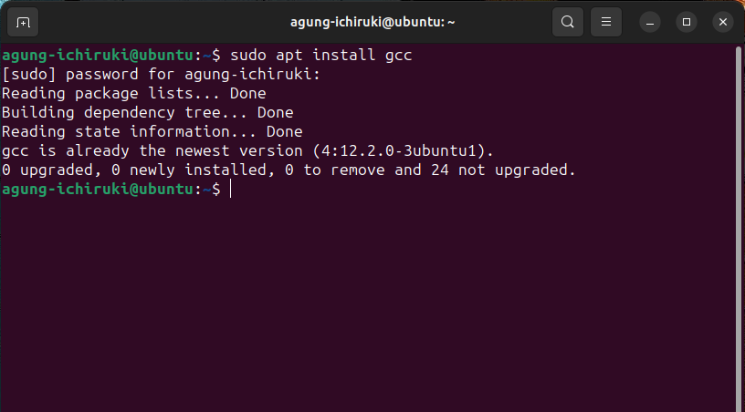

# Persiapan Memprogram Dengan C++
Untuk memprogram dengan bahasa C++, dibutuhkan aplikasi text editor dan kompiler atau gabungan text editor dan kompiler yang dinamakan IDE (Integrated Development Environment). Ada beragam text editor yang tersedia, mulai dari bawaan sistem operasi seperti notepad milik windows, lintas platform seperti emacs, yang berbayar seperti sublime text, yang gratis seperti notepad++, atau yang berbasis CLI seperti vim.

Sama seperti text editor, compiler C++ juga beragam dan tersedia di berbagai platform sistem operasi seperti Borland C++ dan embarcadero C/C++ untuk windows, GNU Compiler Collection (GCC) untuk distribusi GNU/Linux, dan CLANG untuk MacOS.

Begitu juga dengan IDE, ada banyak sekali pilihan IDE yang bisa digunakan untuk menulis source code dan mengkompilasi C++ seperti Visual Studio Code, Atom, Sublime Text, Code::Blocks, dan masih banyak lagi.

## 3.1 Text Editor
Text editor atau IDE adalah aplikasi  Pada catatan ini, saya akan menggunakan IDE Visual Studio Code yang dibuat oleh Microsoft. IDE ini adalah IDE open source dan memiliki banyak tema yang menarik dan plugin yang dapat membantu kita dalam menulis source code C++.



*Homepage Visual Studio Code* 

Download installer Visual Studio Code [disini](https://code.visualstudio.com/Download). Sesuaikan dengan sistem operasi yang digunakan.

## 3.2 Compiler
Pada catatan ini, saya akan menggunakan compiler "GNU Compiler Collection (GCC)" dari project GNU. Untuk menginstall compiler ini pada distribusi GNU/Linux cukup mudah dengan bantuan package manager bawaan dari distribusi linux yang digunakan. Disini saya menggunakan distribusi ubuntu dengan package managernya "apt".

Jalan perintah dibawah ini pada terminal untuk menginstall compiler GCC.

```
sudo apt update && sudo apt install -y gcc
```



Perintah diatas bisa dijalankan untuk distribusi seluruh distribusi debian, ubuntu, dan turunannya.