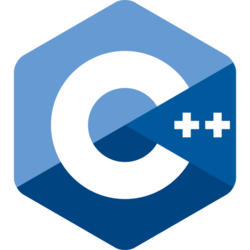

# 1. Pengenalan C++
C++ adalah salah satu bahasa yang cukup tua yang masih banyak digunakan oleh para programmer hingga saat ini. Beragam aplikasi untuk berbagai platform bisa dibuat menggunakan bahasa ini. Bahasa ini juga cocok dijadikan sebagai bahasa pertama untuk mempelajari pemrograman komputer, karena bahasa memiliki fitur yang cukup lengkap dan mendukung berbagai paradigma pemrograman atau disebut juga multi-paradigm.

## 1.1 Sekilas Tentang C++

*Gambar diatas adalah logo dari bahasa pemrograman C++*

C++ adalah bahasa pemrograman general-purpose tingkat menengah yang dibuat oleh ilmuwan komputer asal Denmark **Bjarne Stroustrup** pada tahun 1979 ketika ia bekerja di laboratorium **AT&T Bell Labs**. Saat itu Stroustrup mengalami masalah ketika ingin mengembangkan sistem operasi **Unix** tepatnya saat  menganalisis kernel Unix yang berhubungan dengan komputasi terdistribusi. Stroustrup kemudian ia teringat dengan tesis Phd yang dulu dikerjakannya, saat itu ia tertarik dengan bahasa **Simula** yang sangat cocok digunakan untuk membuat aplikasi berskala besar. Ini karena varian Simula yaitu Simula 67 mendukung dan menjadi yang pertama menerapkan konsep pemrograman berbasis objek. Tetapi Simula sangat lambat dan dianggap tidak cocok untuk penggunaan sehari-hari.

*Foto diatas adalah Bjarne Stroustup sang pecipta Bahas Pemrograman C++*

Stroustrup akhirnya memutuskan untuk membuat bahasa baru dengan mengembangkan bahasa C dan menambahkan fitur-fitur baru seperti dukungan terhadap *class* yang membuat bahasa baru ini mendukung paradigma pemrograman berbasis objek seperti Simula. Selain Simula, bahasa ini juga terinspirasi dari bahasa pemgrograman lain seperti **ALGOL 68**, "**ADA**, **CLU**, dan **ML**. Pemilihan bahasa C dikarenakan C cukup cepat, populer, dan juga bahasa yang digunakan untuk membuat sistem operasi Unix.

Karena dukungan terhadap *class*, bahasa ini awalnya dinamakan **C with classes**. Kemudian diubah menjadi **C++* pada tahun 1983. ++ pada nama C++ memiliki arti bahwa bahasa ini adalah bahasa C yang ditambahkan berbagai fitur hingga meningkatkan kompleksitasnya. Selain paradigma pemrograman berbasis objek, C++ juga mendukung berbagai paradigma pemrograman lain seperti paradigma pemrograman prosedural, fungsional, generik, dan modular.

## 1.2 Versi C++
Versi pertama C++ dirili pada tahun 1985. Kemudian pada tahun 1998, badan standarisasi **ISO** dengan **JTC1/SC22/WG21** working groupnya mulai menstandarisasi bahasa C++ dengan merilis **C++98** dan merupakan rilis major. 

Tahun 2003, versi terbaru C++ dirilis dengan nama **C++03**. versi ini adalah rilis minor yang merupakan revisi dari versi sebelumnya yaitu c++98.

Tahun 2011, versi terbaru dirilis dengan nama **C++11** atau **C++0x** yang merupakan rilis major.

Tahun 2014, versi terbaru dirilis dengan nama **C++14** atau **C++1y**. versi ini adalah rilis minor yang merupakan revisi dari versi sebelumnya yaitu c++11.

Tahun 2017, versi terbaru dirilis dengan nama **C++17** atau **C++1z**. versi ini juga adalah rilis minor yang merupakan revisi dari versi sebelumnya yaitu c++11 dan C++14.

Tahun 2020, versi terbaru dirilis dengan nama **C++20** atau **C++2a**. Versi ini merupakan rilis major dan menjadi versi terbaru saat catatan ini dibuat.

Kemudian **C++23** adalah versi major yang menjadi rilis masa depan yang direncanakan akan dirilis pada bulan desember 2023.

Sejak pertama kali dirilis tahun 1985, bahasa ini sudah berumur 37 tahun (2023). Meskipun tergolong cukup tua, bahasa ini masih terus dikembangkan dan direvisi hingga saat ini.

## 1.3 Keunggulan C++
Bahasa pemrograman C++ memiliki beberapa kelebihan dibandingkan dengan bahasa pemrograman lainnya, diantaranya adalah
dukungan terhadap berbagai paradigma pemrograman khususnya paradigma pemrograman berbasis objek. Hal ini memungkinkan kita untuk menerapkan konsep pemrograman berbasis objek seperti polimorfime, enkapsulasi, pewarisan dan abstraksi dengan C++. Ini merupakan perbedaan dan kelebihan C++ dari C yang belum mendukung paradigma pemrograman berorientasi objek.

C++ adalah bahasa pemrograman yang di-compile. Artinya, kode sumber dari aplikasi yang kita tulis dengan bahasa ini harus di ubah (compile) oleh compiler menjadi binary file. Ini menjadikan aplikasi yang ditulis dengan bahasa ini menjadi cepat, kuat, dan dapat diandalkan. Karena kelebihan inilah C++ juga digunakan untuk menulis berbagai macam jenis aplikasi mulai dari aplikasi desktop, driver, hingga game yang dikenal cukup rumit.

Cross Platform atau lintas platform, juga menjadi salah satu kelebihan dari bahasa ini. Ini karena terdapat berbagai macam compiler dari bahasa ini yang tersedia untuk berbagai macam platform seperti **borland C++** dan **Embarcadero C/C++** untuk sistem operasi Windows, **GNU Compiler Collection (GCC)** untuk distribusi GNU/Linux, dan **CLANG** untuk sistem operasi MacOS. Selama compiler-nya tersedia pada suatu platform, maka kita bisa membuat aplikasi dengan C++ untuk platform tersebut.

C++ juga memiliki skalabilitas yang baik. Bahasa ini cocok untuk membuat aplikasi berskala kecil hingga aplikasi berskala besar. Atau kita juga bisa membuat aplikasi berskala kecil yang seiring waktu berkembang menjadi berskala besar dengan bahasa ini.

C dan C++ juga menjadi bahasa yang menginspirasi bahasa tingkat tinggi seperti **C#**, **Go**, **Java**, **PHP**, **JavaScript**, dll. Jadi, dengan memahami C++, kita bisa cukup mudah untuk memahami konsep-konsep pemrograman yang ada pada bahasa pemrograman yang terinspirasi dari C++. Maka dari itu, bahasa ini sering dipakai untuk mempelajari dasar aloritma dan pemrograman.