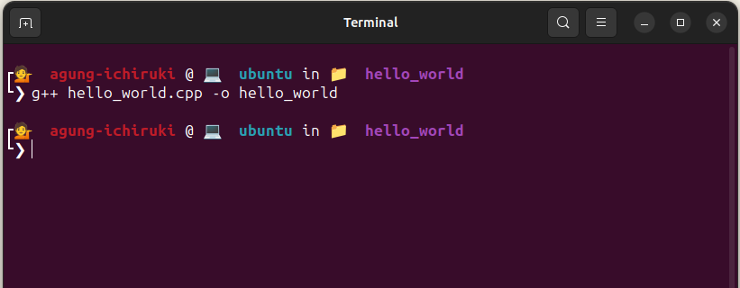
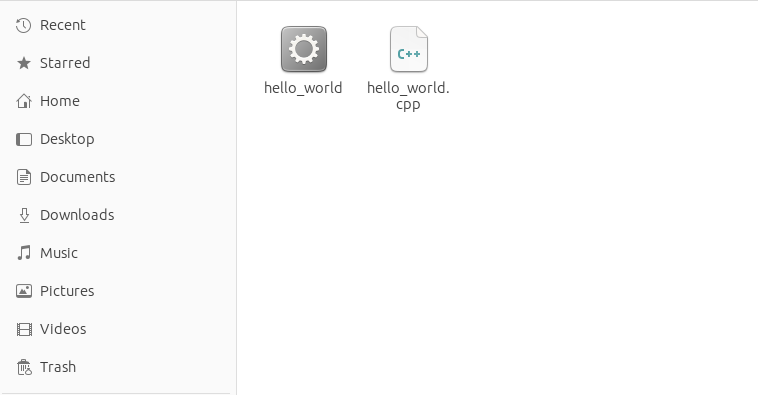
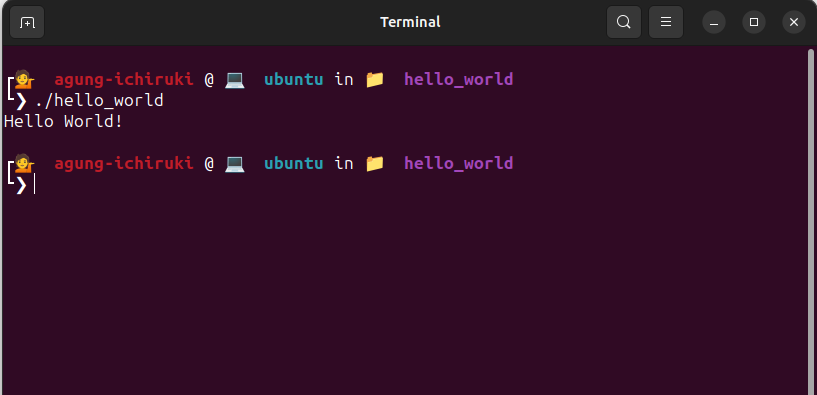

# Mengkompilasi Dan Menjalankan Hello World
Kode sumber dari aplikasi "Hello World" yang sudah dibuat pada catatan sebelumnya belum bisa kita jalankan. Butuh proses kompilasi dengan compiler untuk mengkonversinya menjadi binary file atau aplikasi agar dapat dijalankan.

## 5.1 Kompilasi
Buka terminal kemudian arahkan path-nya ke folder tempat file kode sumber tersimpan. Kemudian, untuk mengcompile kode sumber C++ dengan GCC, gunakan format perintah :

```
g++ nama_file_kode_sumber.cpp -o nama_file_aplikasi_hasil_compile
```

Contoh pada kode sumber "Hello World".

```
g++ hello_world.cpp -o hello_world
```



Setelah proses kompilasi berhasil dengan ditandai tidak adanya pesan error, maka akan muncul file aplikasi atau binary file hasil dari proses kompilasi tadi yang dapat dijalankan langsung.



## 5.2 Menjalankan Aplikasi Hello World
Masih pada terminal yang sama, untuk menjalankan aplikasi hello_world ini gunakan perintah :

```
./hello_world
```



Terlihat pada terminal tercetak teks "Hello World!" ketika kita menjalankan aplikasi hello_world. Ini menandakan bahwa aplikasi ini berhasil dijalankan tanpa adanya error.